# TerraGuard: AI-Powered Landslide Early Warning & Spatial GIS Dispatch System (LEWS)

[](https://mdoner.gov.in/)
[](https://ndma.gov.in/)
[](#)
[](#)
[](#)
[](#)

A mission-critical, AI-driven **Landslide Early Warning System (LEWS)** engineered for critical transit corridors across the **Himalayas and the North Eastern Region (NER)** — including **Uttarakhand (Uttarkashi/Gangotri NH-34), Sikkim (Teesta Basin NH-10), Meghalaya (Sohra Rim SH-5), Assam (Dima Hasao NH-27), and Manipur (Tupul/Noney NH-37)**.

Developed in compliance with **Geological Survey of India (GSI)** and **National Disaster Management Authority (NDMA)** guidelines, TerraGuard unifies Sentinel-1 InSAR synthetic aperture radar, NASA SRTM 30m digital elevation contours, piezometric pore-water sensors, ensemble machine learning, and Common Alerting Protocol (CAP 1.2) emergency broadcasts.

---

## 📱 The 6 TerraGuard Interfaces

| Screen # | Module | Route | Highlights |
|:---|:---|:---|:---|
| **1** | **Home Page** | `/home` | Hero banner (*"Early Warnings Save Lives"*), interactive location search with autocomplete, 4 core feature cards, live High/Med warning marquee, and community protection statistics. |
| **2** | **Dashboard** | `/dashboard` | Location selector, Current Risk Level card (`Uttarkashi, Uttarakhand` — 78% risk, 120mm rain, 85% soil moisture, 35° slope), optical drone reconnaissance image carousel (`< 1/3 >`), 4 quick actions, and warning zones telemetry grid. |
| **3** | **Risk Map (GIS 3D)** | `/risk-map` | Left sidebar with corridor search, **Risk Zones** checkboxes (`High`, `Moderate`, `Low`, `Past Events`), **Map Layers** checkboxes (`Rainfall`, `Soil Moisture`, `Slope`, `Historical Events`, `ML Heatmap`), Google Earth Satellite canvas, and geotechnical inspector. |
| **4** | **Risk Details** | `/risk-details` | Radial circular progress gauge (78% / 85.7%), *"Why is the risk high?"* geological factor attribution, interactive dual-bar comparative chart (10-year baseline vs 2026 recorded data across **Rainfall**, **Soil Moisture**, **Temperature**, and **Events**), and nearby relief shelters with safe routes. |
| **5** | **Alerts Feed** | `/alerts` | Real-time hazard warning feed filterable by severity pills (`All`, `High`, `Moderate`, `Low`) and region dropdown, showing 24h rainfall, pore water pressure, road blockage notices, and direct GIS inspection links. |
| **6** | **Emergency SOS** | `/emergency-sos` | High-visibility circular red SOS beacon with radiation waves, offline GPS coordinate sharing via SMS gateway (`sms:1078?body=...`), clipboard copy, and categorized 24x7 emergency helplines (`Government`, `Local District`, `Medical`, `Search & Rescue`). |

### Additional Engineering & AI Modules
- **Real Landslide Risk Simulator (`/risk-simulator`)**: Interactive parameter tester evaluating terrain elevation, slope gradient, aspect, soil taxonomy, land-cover class, and multi-day cumulative precipitation with real-time inference from the trained Random Forest model.
- **ML Models & Pipeline Sandbox (`/ml-models-pipeline`)**: Train and evaluate models on 19 integrated datasets, inspect ROC curves, confusion matrices, and feature importance rankings.
- **Temporal LSTM Predictor (`/temporal-lstm-predictor`)**: Factor-of-Safety ($FoS$) regression and dynamic 12-hour evacuation lead-time countdowns.
- **Citizen Crowdsource CV Intake (`/crowdsource-cv-verification`)**: Geo-tagged photo submission with Computer Vision rockfall/scarp verification and automatic CAP alert pre-fill.
- **CAP Dispatch & Tactical Mobilization (`/emergency-broadcast-and-dispatch`)**: Multi-lingual alert dispatch across 7 regional languages (English, Hindi, Bengali, Assamese, Nepali, Meitei, Mizo).

---

## 🤖 Dual Machine Learning Architecture

```mermaid
flowchart LR
    subgraph Data ["Data Inputs (19 Datasets)"]
        DEM["NASA SRTM 30m\nSlope, Aspect, Elev"]
        InSAR["Sentinel-1 InSAR\nDisplacement Velocity"]
        IMD["IMD Radar & AWS\n1d, 3d, 7d, 15d, 30d Rain"]
        IoT["In-Situ Piezometers\nPore Water Pressure"]
    end

    subgraph Models ["Predictive AI Models"]
        RF["Ensemble Random Forest\nROC-AUC: 0.896 | Precision: 94.1%"]
        LSTM["Bidirectional LSTM\nMSE: 0.042 | Lead Time: 0-12h"]
        CV["YOLOv8 / MobileNet CV\nmAP@50: 0.912"]
    end

    subgraph Outputs ["Operational Outputs"]
        RiskScore["Susceptibility Score (0-100%)"]
        Heatmap["Spatial ML Pattern Heatmap"]
        LeadTime["Dynamic Evac Countdown (FoS)"]
        CAP["CAP 1.2 Multi-Channel Broadcast"]
    end

    Data --> Models
    Models --> Outputs
```



- **Random Forest Classifier**: Trained on 654 ground-truth historical landslide events across 19 national and NER datasets.
  - **Accuracy**: 82.4%
  - **Precision**: 94.1%
  - **ROC-AUC**: 0.896
- **Bidirectional LSTM Neural Network**: Continuous regression of geotechnical Factor-of-Safety ($FoS$) based on 48-hour time-series sensor telemetry, providing dynamic evacuation windows ($FoS \le 1.05$ critical trigger).
- **Acoustic Warning Siren**: Native browser Web Audio API dual-oscillator wailing horn simulating a 130 dB emergency siren with instant `ESC` key silence controls.

---

## 📂 Integrated Datasets Inventory (`data/landslides`)

The system natively bundles 19 validated datasets:
1. `NER_Landslide_Events.csv` — Ground truth event catalogue for the North Eastern Region
2. `NER_Landslide_Rainfall_ML_Dataset_654.csv` — Benchmark ML dataset with antecedent precipitation indices
3. `NER_Landslide_Inventory.csv` — GSI historical landslide polygon coordinates
4. `NER_Landslide_Training_Features_Clean.csv` — Preprocessed geotechnical training vectors
5. `India_Landslide_Master_Final.csv` — Pan-India historical landslide inventory
6. `NER_Background_Samples_Validated.csv` — Balanced negative (non-slide) slope samples
7. `NER_Landslide_Temporal_Availability_Audit.csv` — Multi-year satellite data coverage audit
8. ...and 12 additional supporting and deduplicated regional datasets.

---

## 🛠️ Technology Stack

| Layer | Technologies |
|:---|:---|
| **Frontend UI** | React 18, TypeScript, Vite 6, Tailwind CSS v4, Lucide React, Motion |
| **GIS Cartography** | Leaflet GIS, Google Earth Satellite / Hybrid / Terrain basemaps, Canvas ML Heatmaps |
| **Audio Engine** | Web Audio API (Multi-oscillator acoustic siren synthesizer) |
| **Backend API** | Python 3.11, FastAPI, Uvicorn, Pydantic v2, SQLite3 (`landslide_guard.db`) |
| **Machine Learning** | Scikit-Learn, Joblib, NumPy, Pandas, Matplotlib, Seaborn |
| **Alert Protocols** | OASIS Common Alerting Protocol (CAP v1.2 XML), Twilio/Fast2SMS SMS gateway |

---

## 🚀 Quick Start & Local Setup

### 1. Prerequisites
- **Node.js**: v18.x or v20.x+
- **Python**: v3.10 or v3.11+
- **npm** or **pnpm**

### 2. Installation

Clone the repository:
```bash
git clone https://github.com/supernovadevssihproject-team/landslide-ai.git
cd landslide-ai
```

Install frontend dependencies:
```bash
npm install
```

Install Python dependencies:
```bash
pip install -r requirements.txt
```

### 3. Run the Development Environment

Start the **FastAPI Backend Server**:
```bash
python -m uvicorn backend.main:app --reload --port 8000
```
API Documentation will be available at: `http://localhost:8000/docs`

In a separate terminal, start the **React / Vite Frontend**:
```bash
npm run dev
```
The application will launch at: `http://localhost:3000`

### 4. Running Backend Integration Tests

Verify all 19 integration tests (endpoints, ML models, datasets, CAP alerts):
```bash
python backend/test_api.py
```

### 5. Training the ML Models

To retrain the Random Forest model on the 19 datasets:
```bash
npm run ml:train
# or
python ml/train_model.py
```

To evaluate model metrics and generate confusion matrices:
```bash
npm run ml:evaluate
# or
python ml/evaluate_model.py
```

### 6. Production Build

Compile optimized production static assets:
```bash
npm run build
```

---

## 📄 Official Documentation
- **Product Requirement Document (PRD)**: [`docs/PRD.md`](docs/PRD.md)
- **Interactive Walkthrough**: Accessible via the application's *About & ML* module.

---

## 👥 Operational Authority & Support
- **Geological Survey of India (GSI)**: Landslide Susceptibility Cartography
- **Ministry of Development of North Eastern Region (MDoNER)**: Corridor Infrastructure Monitoring
- **National Disaster Management Authority (NDMA)**: Emergency Protocol & Helplines (Toll-Free: `1078` / `1077`)
