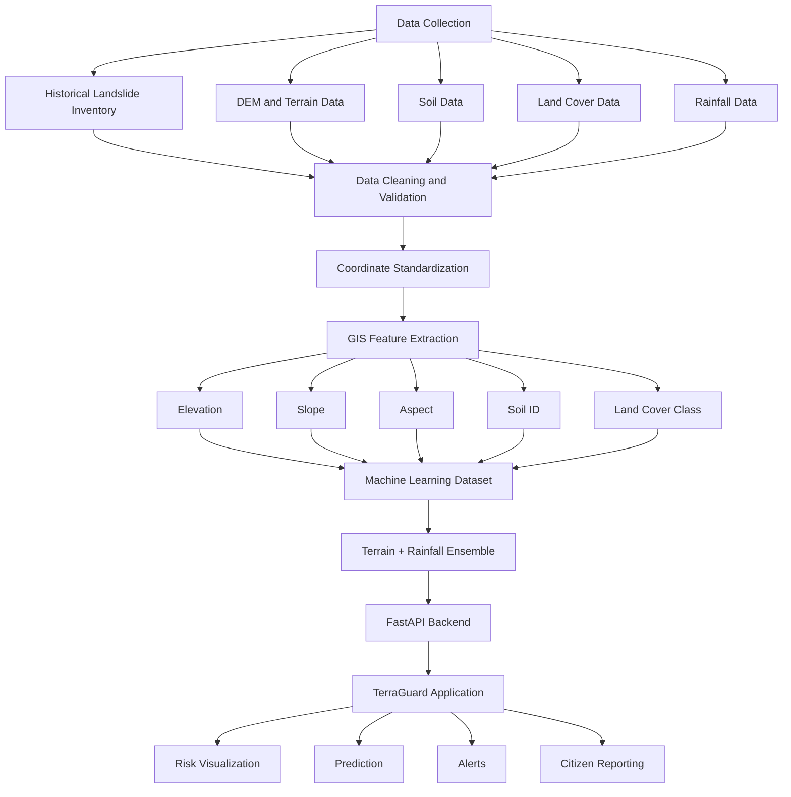

# TerraGuard

## AI-Powered Landslide Early Warning and Spatial Risk Monitoring System

**Smart India Hackathon (SIH) 2026**  
**Problem Statement: 26001**

TerraGuard is an integrated landslide risk monitoring and early warning system designed to support landslide risk assessment in the North Eastern Region of India. The system combines historical landslide inventories, geospatial and environmental datasets, machine learning, GIS-based visualization, backend APIs, citizen reporting, and alert workflows within a unified application.

---

## Table of Contents

1. [Project Overview](#project-overview)
2. [Problem Context](#problem-context)
3. [Proposed Solution](#proposed-solution)
4. [Key Objectives](#key-objectives)
5. [System Features](#system-features)
6. [Application Modules](#application-modules)
7. [System Architecture](#system-architecture)
8. [Data Pipeline](#data-pipeline)
9. [Machine Learning Pipeline](#machine-learning-pipeline)
10. [Datasets](#datasets)
11. [Feature Engineering](#feature-engineering)
12. [Machine Learning Model](#machine-learning-model)
13. [Backend and API Architecture](#backend-and-api-architecture)
14. [Prediction Workflow](#prediction-workflow)
15. [Risk Classification](#risk-classification)
16. [Technology Stack](#technology-stack)
17. [Project Structure](#project-structure)
18. [Installation and Setup](#installation-and-setup)
19. [Project Status](#project-status)
20. [Future Scope](#future-scope)
21. [Team](#team)

---

## Project Overview

Landslides pose significant risks to communities, transportation infrastructure, public assets, and remote settlements, particularly in mountainous and high-rainfall regions. Effective landslide risk assessment requires the integration of terrain characteristics, environmental conditions, historical events, and spatial information.

TerraGuard provides a unified platform for:

- Landslide susceptibility assessment using machine learning
- GIS-based visualization of risk and environmental layers
- Terrain and land-surface analysis
- Integration of historical landslide records
- Location-based risk assessment
- Rainfall and environmental trigger monitoring
- Citizen and field incident reporting
- Alert and emergency response workflows
- API-based communication between the machine learning pipeline and application

The project combines a completed application with a geospatial machine learning pipeline built from processed regional datasets.

---

## Problem Context

Landslide occurrence is influenced by multiple environmental and geographical factors. These factors may include:

- Terrain characteristics
- Slope
- Elevation
- Aspect
- Soil conditions
- Land-cover characteristics
- Rainfall and triggering conditions
- Historical landslide occurrence

Relevant data are commonly distributed across different sources, formats, coordinate systems, and spatial resolutions. A practical landslide monitoring system therefore requires data preparation, validation, spatial feature extraction, machine learning, and an accessible application layer.

TerraGuard addresses this requirement by organizing these components into an integrated data-to-decision workflow.

---

## Proposed Solution

TerraGuard follows the architecture below:

```text
Data Collection
      |
      v
Data Processing and Validation
      |
      v
GIS Feature Extraction
      |
      v
Machine Learning Dataset Preparation
      |
      v
Extra Trees Classification Model
      |
      v
FastAPI Backend
      |
      v
TerraGuard Application
      |
      v
Risk Visualization and Alert Workflows
```

The solution is designed to connect environmental data processing and machine learning outputs with an interactive application for risk assessment and monitoring.

---

## Key Objectives

The primary objectives of TerraGuard are:

1. Consolidate historical landslide and environmental datasets for the study region.
2. Extract relevant terrain, soil, and land-cover features from geospatial data.
3. Build a structured machine learning dataset for landslide susceptibility classification.
4. Train and integrate an Extra Trees-based machine learning model.
5. Provide API-based prediction services through a FastAPI backend.
6. Visualize risk information through GIS-based application interfaces.
7. Support citizen reporting and alert workflows.
8. Establish a foundation for future real-time environmental monitoring and early warning capabilities.

---

# System Features

## Machine Learning-Based Risk Prediction

TerraGuard includes a machine learning pipeline that processes environmental and geographical features to estimate landslide susceptibility.

The established classification model is:

```text
ExtraTreesClassifier
```

The model operates on structured geospatial and environmental features extracted from the project's processed datasets.

---

## GIS-Based Risk Visualization

The application supports GIS-based exploration of spatial information, including:

- Regional risk visualization
- Historical landslide locations
- Terrain information
- Environmental layers
- Risk indicators
- Location-based analysis

---

## Terrain Analysis

Digital Elevation Model data is processed to derive:

```text
Elevation
Slope
Aspect
```

These terrain variables form part of the machine learning feature set.

---

## Soil Analysis

The project integrates HWSD2 soil raster data.

Current machine learning feature:

```text
soil_id
```

The architecture can be expanded to incorporate additional soil properties, subject to metadata availability and validation, including:

- Clay content
- Sand content
- Silt content
- Soil depth
- Bulk density

---

## Land-Cover Analysis

Land-cover information is integrated using ESA WorldCover data.

Current machine learning feature:

```text
landcover_class
```

Land-cover information provides a representation of surface characteristics relevant to spatial susceptibility analysis.

---

## Rainfall and Trigger Monitoring

Rainfall is included as an environmental factor within the TerraGuard data architecture and supports future development of:

- Rainfall accumulation analysis
- Trigger monitoring
- Dynamic risk assessment
- Early warning workflows
- Live environmental data integration

---

## Citizen and Field Reporting

The application supports citizen and field reporting workflows that can capture:

- Geographic location
- Images
- Incident descriptions
- Time information
- Hazard details

This provides a mechanism for incorporating field-level observations into the broader monitoring workflow.

---

## Alert Workflows

The system architecture supports risk communication and alert workflows, including:

- Risk notifications
- Warning feeds
- Location-based alerts
- Emergency workflows
- CAP-compatible alert architecture

Additional notification channels can be integrated in future deployments.

---

# Application Modules

## Home

The home interface provides:

- Project introduction
- Location discovery
- Core feature navigation
- Warning information
- Public awareness content

## Risk Dashboard

The dashboard provides:

- Location-based monitoring
- Risk indicators
- Environmental conditions
- Warning summaries
- Risk telemetry and summaries

## GIS Risk Map

The GIS module provides:

- Regional risk visualization
- Risk zone filtering
- Environmental layer controls
- Historical event visualization
- Machine learning risk visualization
- Location inspection

## Risk Details

The risk details module provides:

- Risk scores
- Contributing environmental factors
- Environmental information
- Location-based risk interpretation
- Safety and response information

## Alerts Feed

The alerts module provides:

- Hazard warning information
- Severity filtering
- Regional filtering
- Environmental trigger information
- GIS inspection links

## Emergency SOS

The emergency module supports workflows such as:

- SOS requests
- Location sharing
- Emergency contact information
- Offline-aware communication workflows
- Safety information

## Additional Modules

The application also includes modules for:

- Landslide risk simulation
- Machine learning pipeline visualization
- Prediction workflows
- Citizen reporting
- Alert and dispatch workflows

---

# System Architecture



---

# Data Pipeline

The data engineering workflow used for the project is organized as follows:

```text
Data Acquisition
      |
      v
Data Cleaning
      |
      v
Data Validation
      |
      v
Duplicate Handling
      |
      v
Coordinate Standardization
      |
      v
Regional Filtering
      |
      v
Environmental Raster Processing
      |
      v
Spatial Feature Extraction
      |
      v
Positive and Background Sample Preparation
      |
      v
Final Machine Learning Dataset
```

---

# Machine Learning Pipeline

```text
Historical Landslide Data
            +
Environmental GIS Data
            |
            v
Data Cleaning
            |
            v
Coordinate Standardization
            |
            v
Regional Data Filtering
            |
            v
Raster Feature Extraction
            |
            v
Elevation
Slope
Aspect
Soil ID
Land Cover Class
            |
            v
Positive Landslide Samples
            +
Background / Negative Samples
            |
            v
Final Machine Learning Dataset
            |
            v
Dataset Validation
            |
            v
Model Training
            |
            v
Extra Trees Classifier
            |
            v
Model Prediction
            |
            v
FastAPI Inference
            |
            v
TerraGuard Application
```

---

# Datasets

## Terrain and DEM Data

Location:

```text
data/dem/
```

Processed terrain datasets include:

```text
NER_elevation.tif
NER_slope.tif
NER_aspect.tif
```

| Feature | Description |
|---|---|
| Elevation | Height above sea level |
| Slope | Terrain steepness |
| Aspect | Terrain direction |

---

## Soil Data

Location:

```text
data/soil/
```

Main raster:

```text
NER_HWSD2_soil.tif
```

Current machine learning feature:

```text
soil_id
```

The soil identifiers provide a foundation for future integration with soil property metadata and lookup tables.

---

## Land-Cover Data

Location:

```text
data/landcover/
```

Processed raster:

```text
NER_landcover.tif
```

Source:

```text
ESA WorldCover
```

Current machine learning feature:

```text
landcover_class
```

Additional analysis output:

```text
NER_landcover_class_frequency.csv
```

---

## Rainfall Data

Rainfall data forms part of the project's environmental data architecture and is intended to support:

- Historical rainfall analysis
- Trigger analysis
- Dynamic risk assessment
- Early warning integration

---

## India Landslide Master Dataset

The project processed multiple landslide sources into a consolidated India landslide inventory.

Final dataset:

```text
India_Landslide_Master_Final.csv
```

Final processed size:

```text
32,227 records
```

---

## North Eastern Region Landslide Dataset

The India landslide inventory was filtered for the project's North Eastern Region study area.

Dataset:

```text
NER_Landslide_Records_Final.csv
```

Initial regional inventory:

```text
9,297 landslide records
```

---

# Feature Engineering

Environmental raster features were extracted for the regional landslide inventory.

Dataset:

```text
NER_Landslide_Training_Features.csv
```

Core extracted features:

```text
elevation
slope
aspect
soil_id
landcover_class
```

Processing summary:

| Dataset Stage | Records |
|---|---:|
| Initial Landslide Records | 9,297 |
| Complete Feature Records | 9,289 |
| Incomplete Records | 8 |

---

# Positive Training Dataset

Dataset:

```text
NER_Landslide_Training_Features_Clean.csv
```

Records:

```text
9,289
```

Class label:

```text
label = 1
```

These records represent historical landslide locations with complete environmental feature values.

---

# Background / Negative Samples

Dataset:

```text
NER_Background_Samples_Validated.csv
```

Initial validated sample count:

```text
9,289
```

Class label:

```text
label = 0
```

These samples represent background locations used for the landslide classification dataset.

---

# Final Machine Learning Dataset

Dataset:

```text
NER_Landslide_ML_Dataset.csv
```

Final dataset size:

```text
18,109 records
```

Class distribution:

| Class | Samples |
|---|---:|
| Background / No Landslide (`0`) | 9,289 |
| Landslide (`1`) | 8,820 |
| **Total** | **18,109** |

Core dataset columns:

```text
latitude_standardized
longitude_standardized

elevation
slope
aspect
soil_id
landcover_class

label
sample_type
```

The final dataset was processed to remove invalid and duplicate records and to address conflicting labels.

---

# Machine Learning Model

## Terrain + Rainfall Ensemble

The prediction pipeline combines two complementary models:

```text
Terrain model: ExtraTreesClassifier
Rainfall model: RandomForestClassifier
```

The terrain model is trained from the 18,109-record NER labeled dataset. After
missing-value and duplicate removal, 18,033 records are used for training and
evaluation. The rainfall model remains trained on the 654-record dataset that
contains complete 1-day, 3-day, 7-day, 15-day, and 30-day rainfall windows.

At inference time, the terrain probability contributes 70% and the rainfall
probability contributes 30%. This uses the larger terrain inventory without
inventing rainfall values for records that do not contain them.

Relevant characteristics include:

- Ability to model non-linear relationships
- Ability to capture interactions between input features
- Suitability for structured tabular data
- Probability-based classification output
- Feature importance analysis
- Ensemble-based classification

The trained machine learning pipeline is integrated with the application's prediction workflow.

---

# Backend and API Architecture

TerraGuard uses a Python-based backend architecture centered on:

```text
FastAPI
Python
Uvicorn
Pydantic
```

The backend supports:

- Prediction requests
- Machine learning model inference
- Input validation
- Application APIs
- Reporting workflows
- Alert workflows
- Frontend-backend communication

When the backend is running locally, FastAPI interactive API documentation is available at:

```text
http://localhost:8000/docs
```

---

# Prediction Workflow

```text
TerraGuard Application
           |
           v
API Request
           |
           v
FastAPI Backend
           |
           v
Input Validation
           |
           v
Feature Preparation
           |
           v
Extra Trees Classifier
           |
           v
Prediction Output
           |
           v
Risk Classification
           |
           v
API Response
           |
           v
Risk Visualization
           |
           v
Alert Workflow
```

---

# Risk Classification

Prediction outputs can be presented through the following risk categories:

| Risk Level | Interpretation |
|---|---|
| Low | Lower estimated susceptibility |
| Moderate | Moderate estimated environmental risk |
| High | High estimated susceptibility |
| Critical | Requires immediate attention based on configured thresholds |

These categories support:

- Dashboard visualization
- GIS visualization
- Risk monitoring
- Warning workflows
- Decision support

---

# Technology Stack

| Layer | Technology |
|---|---|
| Frontend | React |
| Language | TypeScript |
| Build Tool | Vite |
| UI | Tailwind CSS |
| Icons | Lucide React |
| Animation | Motion |
| Backend | FastAPI |
| Backend Language | Python |
| API Server | Uvicorn |
| Validation | Pydantic |
| Machine Learning | Scikit-learn |
| ML Model | Extra Trees Classifier |
| Data Processing | Pandas, NumPy |
| Visualization | Matplotlib |
| Geospatial Data | GeoTIFF / Raster Data |
| GIS | Interactive Map Layers |
| Terrain | DEM, Elevation, Slope, Aspect |
| Soil | HWSD2 |
| Land Cover | ESA WorldCover |
| Alert Architecture | CAP-compatible workflows |
| Application Integration | Antigravity-based application workflow |

---

# Project Structure

```text
landslide-ai/
│
├── backend/                  # FastAPI backend and application services
│
├── data/                     # Project datasets
│   ├── dem/
│   ├── soil/
│   ├── landcover/
│   └── landslides/
│
├── docs/                     # Project documentation
│
├── ml/                       # Machine learning pipeline and models
│   ├── models/
│   └── ...
│
├── public/                   # Public application assets
│
├── src/                      # React and TypeScript frontend
│
├── .env.example              # Environment configuration example
├── package.json              # Frontend dependencies and scripts
├── vite.config.ts            # Vite configuration
├── tsconfig.json             # TypeScript configuration
│
└── README.md
```

> Large datasets and generated machine learning artifacts may be managed separately depending on repository size and deployment requirements.

---

# Installation and Setup

## Prerequisites

The development environment requires:

- Node.js 18 or later
- Python 3.10 or later
- npm

---

## Clone the Repository

```bash
git clone https://github.com/supernovadevssihproject-team/landslide-ai.git
cd landslide-ai
```

---

## Install Frontend Dependencies

```bash
npm install
```

---

## Install Python Dependencies

Where a Python requirements file is provided:

```bash
pip install -r requirements.txt
```

---

## Run the Backend

Start the FastAPI backend:

```bash
python -m uvicorn backend.main:app --reload --port 8000
```

API documentation:

```text
http://localhost:8000/docs
```

---

## Run the Frontend

In a separate terminal:

```bash
npm run dev
```

Open the local development URL displayed by Vite.

---

# Running the Machine Learning Pipeline

The project machine learning workflow follows these stages:

```text
1. Prepare Landslide Inventory
        |
        v
2. Clean and Standardize Records
        |
        v
3. Extract GIS Features
        |
        v
4. Generate Background Samples
        |
        v
5. Create Final Machine Learning Dataset
        |
        v
6. Validate Dataset
        |
        v
7. Train Extra Trees Classifier
        |
        v
8. Evaluate Model
        |
        v
9. Save Trained Model
        |
        v
10. Connect Model to FastAPI
        |
        v
11. Serve Predictions to the Application
```

The exact execution commands depend on the scripts and model resources included in the project's machine learning directory.

---

# Project Status

## Dataset Engineering

- Completed landslide inventory collection
- Completed multi-source dataset processing
- Completed data cleaning and validation
- Completed dataset merging
- Completed duplicate handling
- Completed coordinate standardization
- Completed North Eastern Region filtering
- Completed DEM processing
- Completed elevation extraction
- Completed slope extraction
- Completed aspect extraction
- Completed soil integration
- Completed land-cover integration
- Completed feature extraction
- Completed positive sample preparation
- Completed background sample generation
- Completed final machine learning dataset preparation
- Completed dataset validation

## Machine Learning

- Machine learning dataset established
- Environmental feature pipeline established
- Extra Trees model established
- Model training pipeline established
- Prediction pipeline established
- Backend integration workflow established

## Application

- Application interface completed
- Risk dashboard completed
- GIS risk visualization completed
- Risk analysis interface completed
- Alert interface completed
- Emergency SOS workflow completed
- Risk simulation module completed
- Machine learning pipeline interface completed
- Citizen reporting workflows integrated
- Backend application integration completed

---

# Future Scope

Potential future enhancements include:

- Live rainfall API integration
- Soil moisture integration
- Automated satellite data ingestion
- Real-time sensor integration
- Advanced spatial susceptibility maps
- Mobile application deployment
- AI-assisted field image verification
- Push notification integration
- SMS-based alerts
- Expanded CAP integration
- Cloud deployment
- Automated model retraining
- Continuous environmental monitoring pipelines

---

# Project Vision

TerraGuard is intended to establish a data-driven framework that connects:

```text
Environmental Data
        +
Geospatial Analysis
        +
Historical Landslide Information
        +
Machine Learning
        +
Risk Monitoring
        +
Early Warning Workflows
```

The objective is to support improved landslide preparedness, risk awareness, and decision support for landslide-prone regions.

---

# Team

**Team Name:** Supernova Devs
# Team Members:

- B NITHIN CHANDRA GIT REPO: https://github.com/bnithinchandra-dotcom
- B DHANUSH GIT REPO: https://github.com/bondidhanush01-bit
- 3
- 4
- 5
- 6
  

TerraGuard is developed as a Smart India Hackathon solution for **Problem Statement 26001**.

Core project contribution areas include:

- Dataset Engineering
- GIS Processing
- Machine Learning
- Backend Development
- Frontend Development
- API Integration
- Application Development
- System Testing.

---

## License

This project is developed for the Smart India Hackathon solution and academic innovation purposes. Licensing and deployment terms may be defined separately by the project team.
