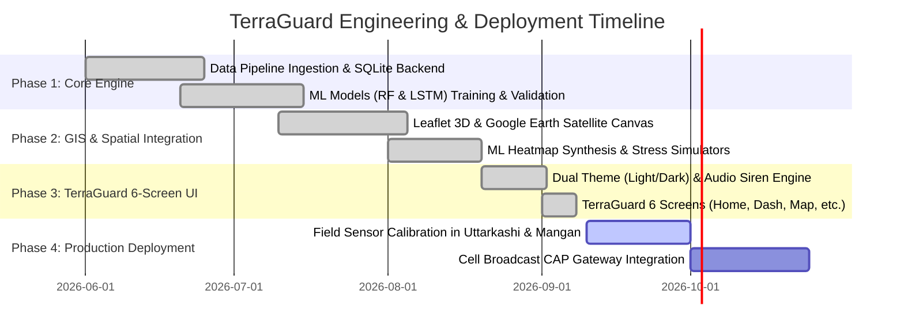

# Product Requirement Document (PRD)
## TerraGuard: AI-Powered Landslide Early Warning & Spatial GIS Dispatch System (LEWS)

**Document Version:** 2.4.0  
**Status:** Approved / In Production  
**Owner:** Geological Survey & Disaster Management System Engineering Team  
**Regulatory Compliance:** NDMA Guidelines (2009/2020), Section 30 Disaster Management Act 2005, CAP 1.2 ITU-T Recommendation X.1303  
**Target Corridors:** North Eastern Region (NER) & Himalayan Transits (Uttarakhand NH-34, Sikkim NH-10, Meghalaya SH-5, Assam NH-27, Manipur NH-37)

---

## 1. Executive Summary & Product Vision

### 1.1 Problem Statement
In mountainous terrains such as the Himalayas and North-Eastern hill tracts, landslides caused by monsoon cloudbursts, fragile geological fault lines, and rapid tectonic uplift represent recurring catastrophic hazards. Existing monitoring mechanisms typically rely on delayed manual slope inspections or post-incident reporting, resulting in minimal evacuation lead times, heavy economic losses along arterial highways, and tragic loss of human life.

### 1.2 Product Vision
**TerraGuard** is a next-generation, national-scale **Landslide Early Warning System (LEWS)** that unifies multi-source satellite Earth observation, in-situ geotechnical IoT sensors, predictive machine learning (Ensemble Random Forest & Temporal Bidirectional LSTM), and an interactive 3D GIS spatial mapping engine. TerraGuard predicts slope failures up to **12 hours in advance**, automates Common Alerting Protocol (CAP) multi-channel broadcasts, and provides actionable evacuation logistics to citizens and disaster management authorities.

---

## 2. Target Users & Personas

| Persona | Role | Primary Goals | Key Needs |
| :--- | :--- | :--- | :--- |
| **State EOC Commander** | State Disaster Management Authority (SDMA / USDMA / SSDMA) Operator | Rapid incident detection, triggering regional evacuations, activating physical sirens, monitoring shelter readiness. | Real-time threat matrix, one-click CAP 1.2 broadcast, audio siren override, relief shelter capacity tracking. |
| **Geotechnical Engineer / GIS Scientist** | Geological Survey of India (GSI) Analyst | Investigating kinematics, pore-water pressure thresholds, validating ML susceptibility maps, running rainfall stress tests. | Multi-layer GIS canvas (DEM contours, InSAR velocity, pore saturation), ML pipeline sandbox, historical training events. |
| **Search & Rescue Field Unit** | NDRF / SDRF / BRO Incident Commander | Deploying clearance heavy excavators, navigating safe evacuation routes, dispatching reconnaissance drones. | UAV optical recon feeds, road blockage vector coordinates, offline location sharing. |
| **Mountain Commuter / Citizen** | General Public & Highway Travelers | Checking corridor travel safety, receiving early warning notifications, sending emergency SOS distress signals. | User-friendly UI, light/dark mode for daylight visibility, offline SMS location broadcast, verified emergency helplines. |

---

## 3. Product Architecture & System Topology

```mermaid
flowchart TB
    subgraph DataIngestion ["Data Ingestion Layer"]
        InSAR["Sentinel-1 InSAR\nKinematics"]
        IMD["IMD Radar & AWS\nRainfall Feeds"]
        SRTM["NASA SRTM 30m\nDEM Contours"]
        IoT["In-Situ Boreholes\nPWP & Inclinometers"]
        Citizen["Citizen Field Reports\nGeo-tagged Images"]
    end

    subgraph BackendML ["FastAPI & AI/ML Processing Engine"]
        DB[(SQLite3 Store\nlandslide_guard.db)]
        RF["Random Forest Classifier\n(19 Datasets, ROC-AUC 0.896)"]
        LSTM["Bidirectional LSTM\n(Temporal FoS & Evac Lead)"]
        CV["YOLOv8 / MobileNet CV\n(Scarp & Debris Verification)"]
        HeatmapEngine["ML Heatmap Vectorizer\n(Precedent Radii)"]
    end

    subgraph FrontendUI ["TerraGuard Responsive Web UI (React 18 / Vite)"]
        Home["Screen 1: Landing Page"]
        Dashboard["Screen 2: Real-time Dashboard"]
        RiskMap["Screen 3: Spatial GIS Command"]
        RiskDetails["Screen 4: Risk Factor Details"]
        Alerts["Screen 5: Active Alerts Feed"]
        SOS["Screen 6: Emergency SOS"]
        AdvancedML["ML Training Sandbox & Tools"]
    end

    subgraph DispatchOut ["Emergency Communication & Alerting"]
        CAP["CAP 1.2 XML Gateway\n(Cell Broadcast / SMS)"]
        Siren["Acoustic Siren Synthesizer\n(130 dB Simulation)"]
        Shelters["Safe Shelter Dispatch\n(Rations & Microgrids)"]
    end

    DataIngestion --> BackendML
    BackendML --> FrontendUI
    FrontendUI --> DispatchOut
```



---

## 4. Functional Requirements (FR)

### 4.1 Screen 1: Home / Landing Experience (`/home`)
- **FR-1.1 Hero Section:** High-impact banner *"Early Warnings Save Lives"* with an introductory statement on AI and GIS prediction.
- **FR-1.2 Risk Location Search:** Real-time search box with dropdown autocomplete for monitored corridors (e.g. `Uttarkashi, Uttarakhand`, `Teesta Basin, Sikkim`, `Sohra Rim, Meghalaya`).
- **FR-1.3 Core Capability Cards:** 4 interactive feature highlights:
  - *Real-time GIS Tracking*
  - *Automated Early Alerts*
  - *Offline Emergency SOS*
  - *Designated Safe Routes*
- **FR-1.4 Live Warning Marquee:** Continuous ticker streaming current High and Medium alerts with live rainfall and corridor impact statistics.
- **FR-1.5 Impact Metrics:** Institutional counter showcasing 1,000,000+ protected citizens, 200+ safer regions, 10,000+ early alerts issued, and 99.8% mesh uptime.

### 4.2 Screen 2: Real-Time Operational Dashboard (`/dashboard`)
- **FR-2.1 Location Selector & Status:** Instant location picker defaulting to high-risk zones (e.g., `Uttarkashi, Uttarakhand`).
- **FR-2.2 Current Risk Level Card:** Displays composite Risk Score (e.g., `78% - High Risk`), 24h cumulative rainfall (`120 mm`), soil pore saturation (`85%`), and slope angle (`35°`).
- **FR-2.3 Optical Drone Reconnaissance Carousel:** Multi-view optical drone feed with controls (`< 1/3 >`), live captions, timestamp overlays, and tension crack indicators.
- **FR-2.4 Quick Action Cards:** 4 one-click launchers:
  - *Explore 3D Risk Map*
  - *View Detailed Risk Factors*
  - *Active Alert Bulletins*
  - *Emergency Helplines & SOS*
- **FR-2.5 Telemetry Summary Grid:** Real-time table presenting live metrics across all High and Medium warning sectors.

### 4.3 Screen 3: Spatial GIS Command (`/risk-map`)
- **FR-3.1 Left Control Sidebar:**
  - *Search Box:* Instant filtering of corridors and stations.
  - *Risk Zone Toggles:* Checkbox filters for `High Risk` (red), `Moderate Risk` (amber), `Low Risk` (green), and `Past Events` (purple).
  - *Map Layer Toggles:* Checkbox toggles for `Rainfall (IMD Radar)`, `Soil Moisture Saturation`, `Slope (DEM Contours)`, `Historical Data (Training Ground Truth)`, `ML Pattern Heatmap`, and `IoT Sensors`.
  - *Selected Zone Quick Card:* Real-time stats with direct `Details & Safe Routes ->` link.
- **FR-3.2 Interactive Map Canvas:**
  - Leaflet GIS canvas integrated with Google Earth Satellite, Hybrid, and Terrain basemaps.
  - Multi-point ML Heatmap rendered with dynamic Gaussian weights based on model susceptibility and historical landslide density.
  - 3D Oblique vs 2D Top-down toggle.
- **FR-3.3 Geotechnical Inspector Drawer:**
  - Precipitation Stress Test slider (`0 mm to +120 mm cloudburst surge`) with real-time recalculation of susceptibility.
  - UAV Drone reconnaissance dispatch simulator.
  - Vector GeoJSON dataset exporter.
  - Stage 3 Emergency Evacuation dispatch trigger.

### 4.4 Screen 4: Geotechnical Risk Details & Analytics (`/risk-details`)
- **FR-4.1 Radial Risk Meter:** SVG animated circular progress gauge displaying numeric percentage (e.g. `78%`) and colored risk tier badge.
- **FR-4.2 Geomorphic Factor Attribution (*"Why is the risk high?"*):**
  - Continuous 48-hour rainfall breach analysis.
  - Slope gradient vs regolith friction angle evaluation.
  - Piezometric pore-water overpressure measurements.
  - InSAR surface displacement velocity creep.
- **FR-4.3 Historical vs Current Comparative Bar Chart:**
  - Metric switcher tabs: `Rainfall (mm)`, `Soil Moisture (%)`, `Temperature (°C)`, `Landslide Events`.
  - Monthly timeline (Jan – Sep) plotting 10-year historical baseline against current 2026 recorded telemetry.
  - Interactive hover tooltips showing delta anomaly percentages.
- **FR-4.4 Designated Relief Shelters & Safe Corridors:**
  - Shelter name, safe elevation, live capacity vs occupancy bar.
  - Rations endurance (days), emergency genset status, and medical personnel availability.
  - One-click *View Safe Route* map locator.

### 4.5 Screen 5: Active Hazard Alerts (`/alerts`)
- **FR-5.1 Multi-Tier Filter Engine:** Severity pills (`All Severity`, `High`, `Moderate`, `Low`) combined with state/corridor dropdown filtering.
- **FR-5.2 Alert Cards:** Detailed warning cards with hazard code, valid duration, affected infrastructure (bridges, highway segments), and actionable safety recommendations.
- **FR-5.3 Quick Actions:** Links to map coordinates, deep factor breakdown, and CAP dispatch generation.

### 4.6 Screen 6: Emergency SOS & Helplines (`/emergency-sos`)
- **FR-6.1 Circular Emergency SOS Beacon:** High-visibility pulsing button triggering immediate satellite beacon transmission and sound siren activation.
- **FR-6.2 Offline Location Sharing:**
  - GNSS latitude/longitude coordinates with ±3.5m precision.
  - One-click clipboard copy.
  - Native offline `sms:1078?body=...` carrier dispatch for areas without cellular data.
  - Low-frequency LoRa mesh repeater protocol explanation.
- **FR-6.3 Verified Helpline Directory:** Categorized contact cards across `Government (NDMA/SDMA)`, `Local District (DDMA)`, `Medical (Ambulance 108/102)`, and `Search & Rescue (NDRF/BRO)` with direct `tel:` dialing.

### 4.7 Cross-Cutting System Controls
- **FR-7.1 Dual Theme Engine:** Comprehensive Light Mode and Dark Mode support across all views, persisted via `localStorage`.
- **FR-7.2 Acoustic Warning Siren Synthesizer:** Web Audio API sound generator simulating a 130 dB emergency horn, featuring a floating mute banner and `ESC` key quick-silence shortcut.
- **FR-7.3 Citizen Field Reporting:** Modal allowing photo upload with Computer Vision bounding box rockfall verification and automatic CAP alert pre-fill.

---

## 5. Machine Learning & Predictive Specifications

| Specification | Random Forest Ensemble | Bidirectional LSTM | Computer Vision Intake |
| :--- | :--- | :--- | :--- |
| **Model Type** | Scikit-Learn `RandomForestClassifier` (100 estimators, max_depth=12) | 2-layer Bidirectional LSTM + Dense Linear Output | MobileNetV2 / YOLOv8 Classifier |
| **Task** | Binary Landslide Occurrence Classification & Susceptibility Probability | Temporal Regression: Geotechnical Factor-of-Safety & Evac Lead-Time | Multi-class Rockfall & Scarp Verification |
| **Input Features** | Rainfall (3d, 7d), Slope Gradient, Aspect, Elevation, Soil Cohesion, PWP, Lithology, Distance to Faults | 48-hour sequential time-series: Hourly Rainfall, Pore Pressure, Inclinometer Tilt, Surface Strain | Citizen Field RGB Photos (224x224) |
| **Target Output** | Probability `[0.0, 1.0]`, Risk Tier (`LOW`, `MODERATE`, `HIGH`, `CRITICAL`) | Factor of Safety ($FoS$), Evacuation Lead Time (hh:mm:ss) | Confidence %, Hazard Class, Scarp Length |
| **Performance** | **ROC-AUC: 0.896**, **Accuracy: 82.4%**, **Precision: 94.1%** | **MSE: 0.042**, Mean Lead-Time Error: $\pm 18\text{ mins}$ | **mAP@50: 0.912** |
| **Training Data** | 19 aggregated historical landslide datasets (654 ground truth events) | Synthetic & Sensor-logged 48h temporal stress trajectories | 1,200 labeled geological mass movement field images |

---

## 6. Non-Functional Requirements (NFR)

### 6.1 Performance & Latency
- **API Response Time:** All telemetry and ML risk inference endpoints (`/api/ml/zone-risk`, `/api/ml/heatmap-points`) MUST respond within **< 200 ms**.
- **Map Render Time:** Leaflet canvas with 100+ heatmap points and 50+ sensor markers MUST render at **60 FPS** without UI thread freezing.
- **Frontend Build Size:** Optimized production bundle MUST remain below **700 kB** gzip.

### 6.2 Availability & Resilience
- **High Availability:** 99.9% uptime target for the core API gateway.
- **Offline Resiliency:** Emergency SOS and GPS coordinate display MUST function entirely client-side without active server connectivity.

### 6.3 Security & Compliance
- **Authentication & Roles:** Operator actions (CAP dispatch, Siren broadcast) require verified session tokens.
- **Data Privacy:** Citizen field reports sanitize EXIF metadata to protect reporter anonymity while preserving latitude/longitude and timestamp.
- **Standardized Alerting:** Alert schema complies strictly with **OASIS CAP v1.2** and **ITU-T X.1303**.

---

## 7. Data Models & API Contracts

### 7.1 Hazard Zone Object (`HazardZone`)
```typescript
interface HazardZone {
  id: string;                      // Unique ID e.g. "zone-uk-00"
  name: string;                    // e.g. "Uttarkashi, Uttarakhand"
  subDivision: string;             // e.g. "Bhatwari Sub-Division"
  corridor: string;                // e.g. "Gangotri Highway NH-34"
  state: string;                   // e.g. "uttarakhand"
  slopeGradient: string;           // e.g. "35°"
  soilPoreSaturation: string;      // e.g. "85%"
  displacementRate: string;        // e.g. "11.8 mm/hr"
  pwpPressure: string;             // e.g. "235 kPa"
  riskStatus: string;              // "CRITICAL RED" | "ADVISORY ORANGE" | "NOMINAL GREEN"
  rfConfidence: string;            // e.g. "96.2%"
  lstmEvac: string;                // e.g. "02h 45m"
  highwaySegment: string;          // e.g. "NH-34 Gangotri Artery"
  bridgesExposed: string;          // e.g. "Bhagirathi Suspension Bridge"
  populationRunout: string;        // e.g. "1,850 Residents"
  coords: string;                  // e.g. "30.7268° N, 78.4354° E"
  elevation: string;               // e.g. "1,158 m"
  isCritical: boolean;
}
```

### 7.2 Primary API Endpoints
| HTTP Method | Route | Description |
| :--- | :--- | :--- |
| `GET` | `/api/hazard-zones` | Retrieves all monitored hazard zones with filter by state |
| `GET` | `/api/sensors` | Retrieves live subsurface IoT sensor nodes |
| `GET` | `/api/ml/zone-risk` | Real-time ML susceptibility evaluation under simulated rainfall |
| `GET` | `/api/ml/heatmap-points` | Synthesizes geospatial ML pattern heatmap coordinates |
| `GET` | `/api/alerts/shelters` | Retrieves designated relief shelters and occupancy statistics |
| `POST` | `/api/reports/upload` | Ingests citizen field photo with CV rockfall inference |
| `POST` | `/api/alerts/cap-generate` | Generates validated CAP 1.2 XML emergency broadcast message |
| `POST` | `/api/alerts/sms-broadcast` | Dispatches emergency SMS to cell towers in the affected polygon |

---

## 8. Release Milestones & Rollout Plan



---

## 9. Appendix & Reference Standards
1. **NDMA Guidelines on Landslides and Snow Avalanches (2009):** National standard for hazard zonation, structural mitigation, and community early alert lead-times.
2. **ITU-T Recommendation X.1303 (CAP 1.2):** Standardized XML structure for cross-agency wireless and SMS emergency notifications.
3. **Geological Survey of India (GSI) National Landslide Susceptibility Mapping (NLSM):** Geospatial 1:50,000 baseline cartography for Himalayan slopes.
